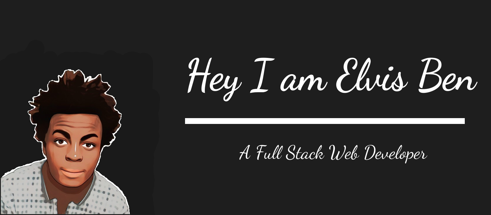

You've probably already read that am a full stack web developer and if not you just did.

I preferred specializing on the LAMP stack over the MERN stack. Further niching down to web apps built from scratch, sounds crazy with all the tools available eh?(Well of course I use some libraries here and there) 

### What I know
- Backend
    - PHP
    - NodeJS

- Frontend
    - HTML5
    - CSS3
    - JavaScript

- Frameworks
    - Laravel
    - Wordpress

- Databases
    - SQL
    - SQLite
    - MySQL

- Libraries
    - React
    - Bootstrap
    - jQuery

- Testing
    - PHPUnit
    - Puppeteer

- Dependency Manager
    - composer
    - npm    

### Stuff you should try

To checkout my portfolio <a href="https://bit.ly/elvisben-portfolio">click here</a>

To checkout my freelance reviews <a href="https://bit.ly/xlvisben">click here</a>

To checkout some snippets, packages, utilities and APIs I have made <a href="https://bit.ly/xlvisbenstuff">click here</a>

<a href="mailto:hello@elvisben.me.ke">Click here to email me<a/>
